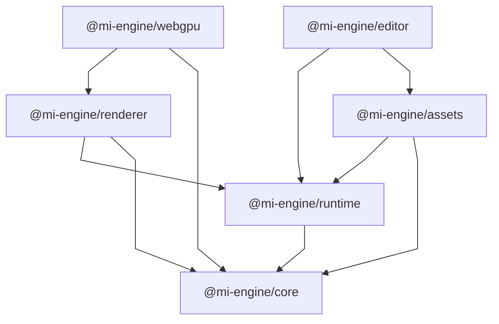

# Package Dependencies

This document describes the current dependency structure and architectural boundaries of the `mi-engine` packages.

An arrow `A → B` means that `A` depends on `B`.

## Package Dependency Graph

The graph below shows only package-to-package dependencies. Application relationships are described separately because they represent higher-level consumption rather than the complete set of direct `package.json` dependencies.

## Dependency Rules

- `runtime` depends on `core`.
- `renderer` depends on `runtime` and `core`.
- `assets` depends on `runtime` and `core`.
- `webgpu` depends on `renderer` and `core`.
- `editor` consumes the public APIs of `runtime` and `assets`.
- `renderer` must not depend on `webgpu`.
- `core` and `runtime` remain independent of Angular, the DOM, and concrete rendering implementations.
- Cross-package imports must use public package exports.
- Deep imports into another package's internal source are not allowed.
- Cyclic package dependencies are not allowed.

## Application Relationships

### Studio

`apps/studio` is the Angular application shell. It consumes `@mi-engine/editor` and other public engine APIs.

Engine packages must not depend on Angular or on Studio internals.

### Playground

`apps/playground` is used for runtime, rendering, experiments, and smoke testing. It consumes public engine packages and must not depend on Studio internals.
