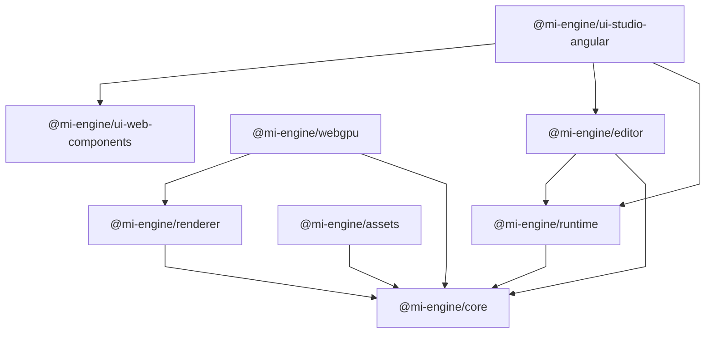

# Package Dependencies

This document describes the current dependency structure and architectural
boundaries of the `mi-engine` packages.

An arrow `A → B` means that `A` depends on `B`.

## Package Dependency Graph

The graph below shows package-to-package dependencies. Application relationships
are described separately because applications represent higher-level consumers
rather than foundational package dependencies.



The UI package relationships describe the intended architectural boundary.
Their concrete dependencies may remain minimal until Studio UI implementation
begins.

## Dependency Rules

- `runtime` depends on `core`.
- `renderer` depends on `core`.
- `assets` depends on `core`.
- `webgpu` depends on `renderer` and `core`.
- `editor` depends on `core` and `runtime`.
- `ui/web-components` is framework-agnostic and must not depend on Angular,
  Angular CDK, Studio, or editor-specific application state.
- `ui/studio/angular` may depend on Angular, Angular CDK, and the portable
  Web Components package. It may consume engine/editor public APIs required by
  Studio UI responsibilities.
- The package source is currently a minimal version surface. Runtime, renderer,
  asset, editor, and UI capabilities will be added behind these existing
  boundaries as their implementation becomes real.
- `renderer` must not depend on `webgpu`.
- `core` and `runtime` remain independent of Angular, the DOM, and concrete
  rendering implementations.
- Engine packages must not depend on Studio or UI packages.
- Cross-package imports must use public package exports.
- Deep imports into another package's internal source are not allowed.
- Cyclic package dependencies are not allowed.

## Framework Boundaries

The framework-specific boundary is intentionally kept above foundational engine
packages.

```text
apps/studio/angular
        ↓
ui/studio/angular
        ↓
ui/web-components
        ↓
Web Platform
```

The following packages remain independent from Angular:

```text
core
runtime
renderer
webgpu
assets
editor
ui/web-components
```

Angular-specific behavior belongs in:

```text
ui/studio/angular
apps/studio/angular
```

Angular CDK and Angular Forms should not be introduced into
`ui/web-components` merely to simplify Studio integration.

Where a portable Web Component needs deep Angular integration, use an Angular
adapter at the Angular boundary rather than coupling the portable package to
Angular.

## Application Relationships

Applications are higher-level consumers of package APIs.

### Web

`apps/web` is the planned public-facing portal for the mi-engine ecosystem.

It is intended to present the project and its products, showcase examples and
capabilities, and provide entry points to Studio, Docs, demos, and other
resources.

The implementation technology is intentionally left open.

When implemented, it must consume public package exports and must not depend on
Studio internals or become the owner of reusable engine functionality.

### Studio

`apps/studio/angular` is the Angular application shell and composition layer.

It is responsible for:

- application bootstrap
- routing
- top-level providers
- application configuration
- workspace composition
- feature wiring
- application lifecycle

The application consumes public package exports.

Reusable Studio UI belongs in `ui/studio/angular`, while generic portable UI
belongs in `ui/web-components`.

Engine packages must not depend on Angular or Studio internals.

### Playground

`apps/playground` is reserved for runtime, rendering, experiments, and smoke
testing.

Its entry point should consume public engine packages and must not depend on
Studio internals.

### Docs

`apps/docs` provides the application boundary for the documentation portal.

It may consume public package APIs and canonical documentation from `docs/`,
but it must not become the owner of reusable engine functionality or a
competing source of truth.

## Package Boundaries and Scaling

- **Extracting Packages**: A feature does not automatically require a new
  package. Extract a new package only when there is a real architectural
  boundary, clear ownership, and sufficient independence to justify separate
  testing, versioning, or reuse.
- **Physical Grouping**: Packages may be grouped by architectural family when
  repository navigation benefits from the grouping.
- **Independent Boundaries**: A leaf package remains independently bounded by
  its own `package.json`, public API, dependency graph, and build configuration.
- **Organizational Directories**: Grouping directories such as `packages/ui/`
  and `packages/ui/studio/` do not themselves represent packages unless they
  contain their own package definitions.
- **Dependency Flow**: Specializations and leaf implementations depend on
  foundational engine contracts; engine packages never depend on applications,
  genres, workflows, or concrete backends.
- **Governing Rule**:

  > Create boundaries because responsibilities and dependencies require them;
  > group packages physically when that organization provides meaningful
  > repository structure without creating artificial dependencies.

- **Architecture Decision Records**: Any change that introduces new package
  boundaries, alters dependency relationships, or introduces public
  architectural contracts must be recorded in an ADR in `adr/` (see
  `adr/README.md`).
